## Setup AWS Manual

1. Login ke aws account

2. pilih ec2

3. klik launch 

4. masukan name and tags

```
dev1-crud-1
```

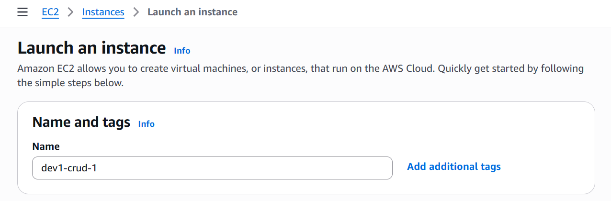

5. Pilih os (ubuntu)


6. pilih instance type 

```
t2.micro
```

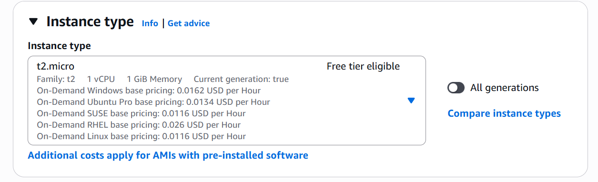

7. Buat atau masukan (jika sudah ada) key pair

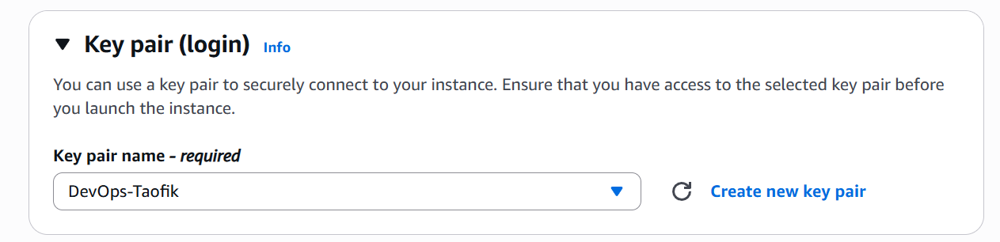

8. Untuk network setting biarkan default aja

9. untuk Security group buat atau masukan (jika sudah ada)

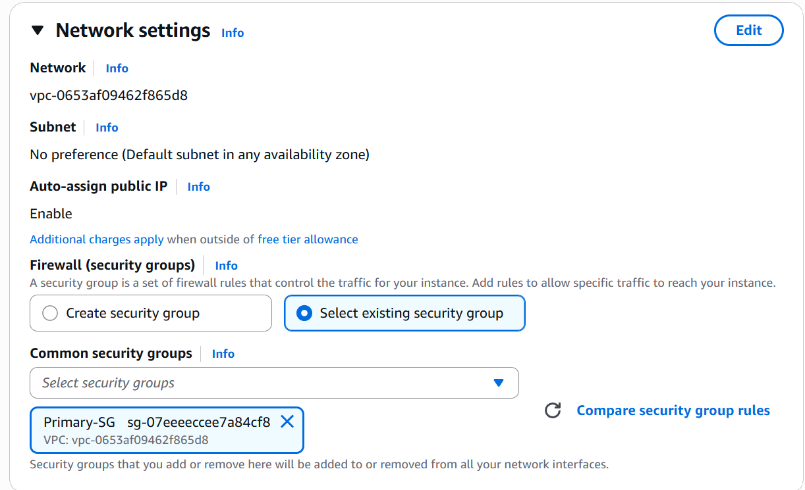

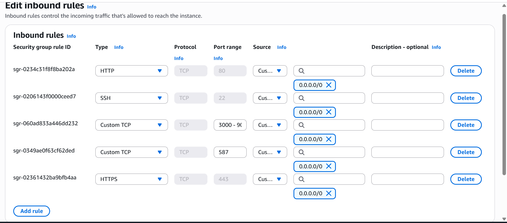

10. untuk storage default aja

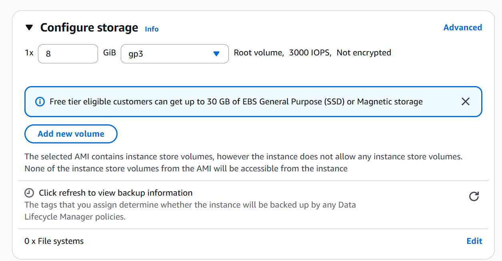

11. Klik launch

## Akses Server with mobaxterm

1. Centang instance 

2. copy ip public

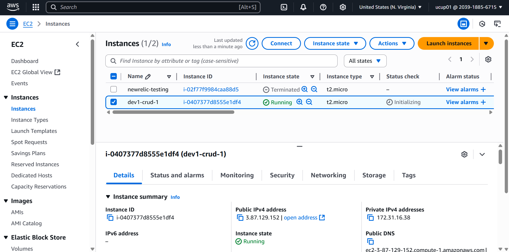

3. Buka aplikasi mobaxterm

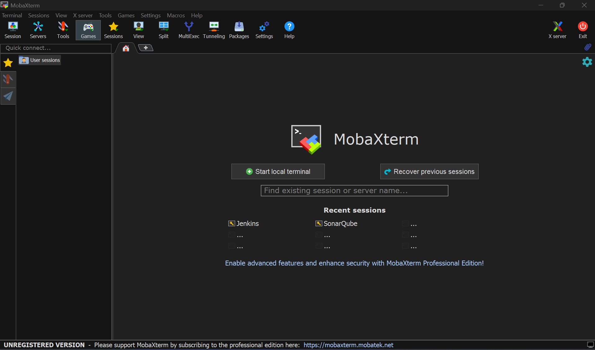

4. pilih session

5. pilih ssh isi public ip dan name


6. pilih advanced ssh settings lalu pilih private-key yang digunakan sebagai key pair tadi

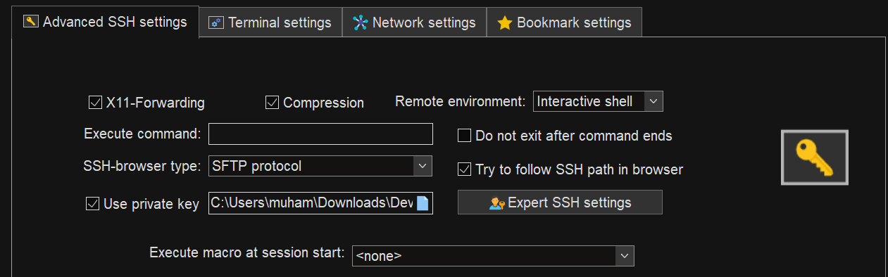

7. klik bookmark settings lalu beri nama server nya

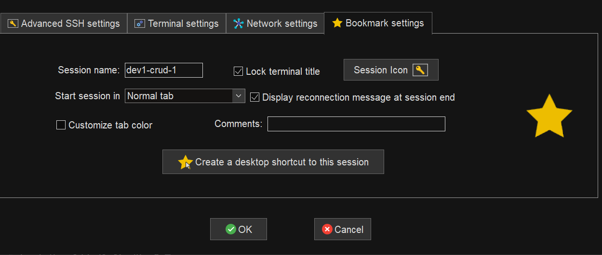

8. klik ok

9. maka server bisa diakses

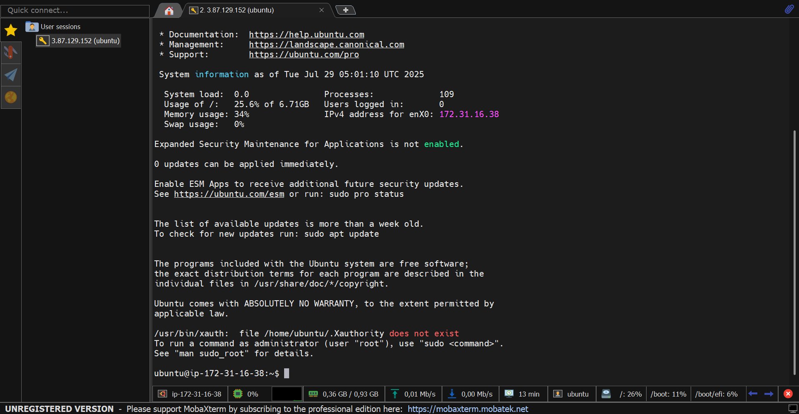

## Install nodejs 

1. jalankan update dependency linux

```
sudo apt update
```

2. install node package

```
# Download and install nvm:
curl -o- https://raw.githubusercontent.com/nvm-sh/nvm/v0.40.3/install.sh | bash

# in lieu of restarting the shell
\. "$HOME/.nvm/nvm.sh"

# Download and install Node.js:
nvm install 22

# Verify the Node.js version:
node -v # Should print "v22.17.1".
nvm current # Should print "v22.17.1".

# Verify npm version:
npm -v # Should print "10.9.2".
```

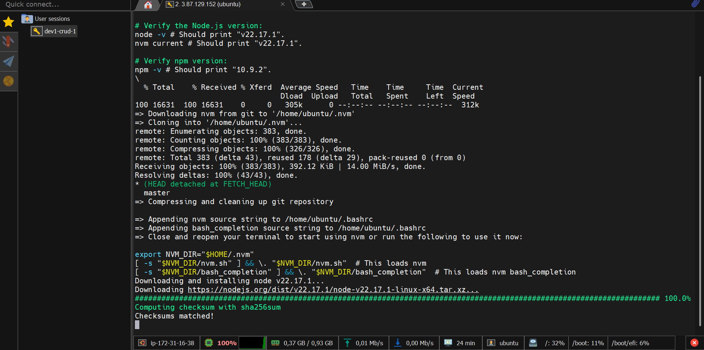

## Clone repo

1. gunakan perintah berikut untuk clone repo

```
git clone -b local-dev --single-branch https://github.com/jaiswaladi246/3-Tier-DevSecOps-Mega-Project.git
```

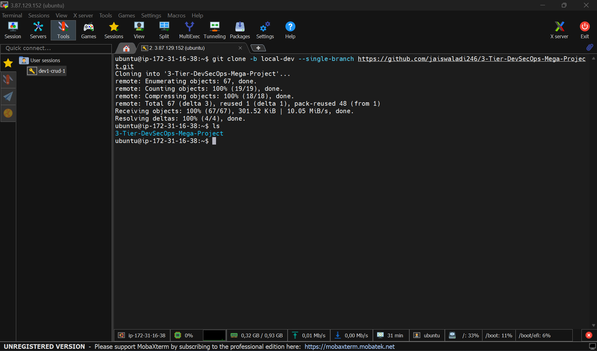

2. buat branch main karena kita clone single branch

```
git branch main
```

## Install mysql

1. install dengan perintah

```
sudo apt install mysql-server -y
```

2. akses mysql dengan perintah 

```
sudo mysql
```

3. terapkan kata sandi pada root user

```
ALTER USER 'root'@'localhost' IDENTIFIED WITH mysql_native_password BY 'mtc0d3';
FLUSH PRIVILEGES;
EXIT;
```

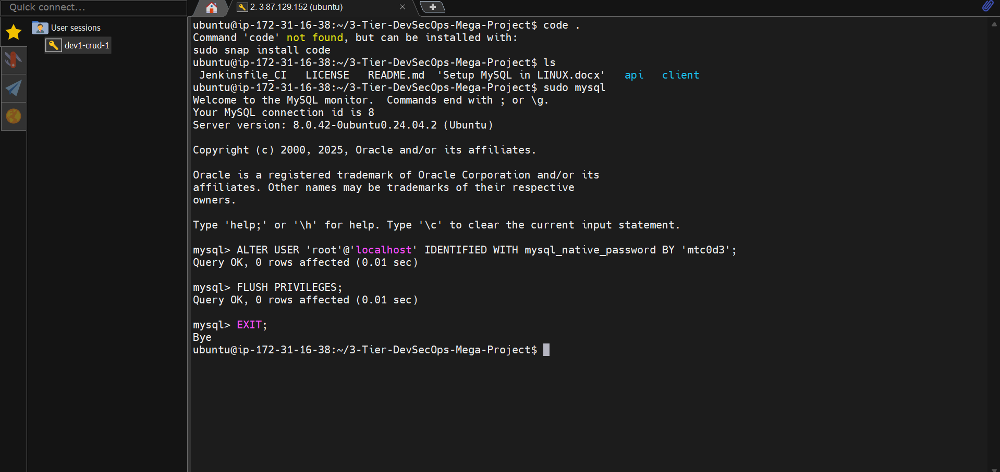

4. coba tes lagi dengan root user

```
sudo mysql
```

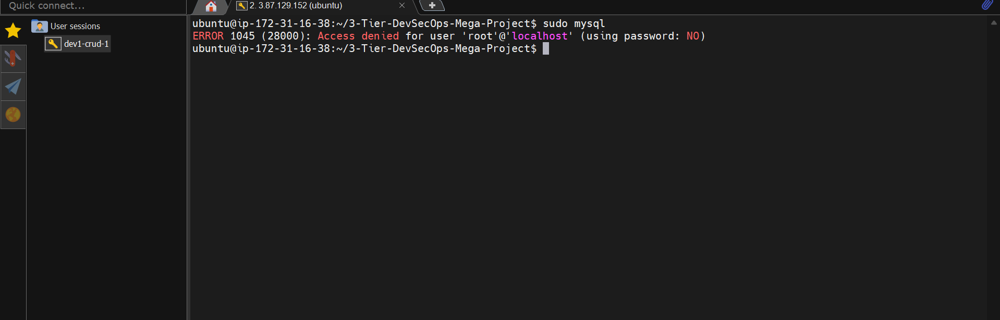

5. maka sekarang harus menggunakan perintah

```
sudo mysql -u root -p
```

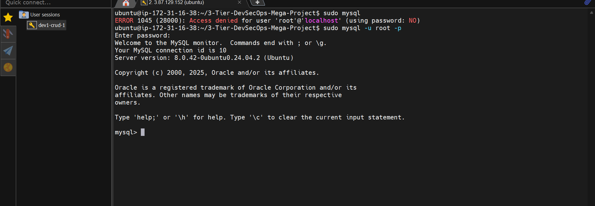

## Buat database dan tabel

1. akses mysql (kali ini pakai user root aja)

```
sudo mysql -u root -p
```

2. buat database dan tabel 

```
-- Create the database if not already exists
CREATE DATABASE IF NOT EXISTS crud_app;

-- Switch to the database
USE crud_app;

-- Drop table if needed (optional safety cleanup)
-- DROP TABLE IF EXISTS users;

-- Create the `users` table with proper structure
CREATE TABLE IF NOT EXISTS users (
  id INT AUTO_INCREMENT PRIMARY KEY,
  name VARCHAR(255) NOT NULL,
  email VARCHAR(255) NOT NULL UNIQUE,
  password VARCHAR(255) NOT NULL,
  role ENUM('admin', 'viewer') NOT NULL DEFAULT 'viewer',
  is_active TINYINT(1) DEFAULT 1,
  created_at TIMESTAMP DEFAULT CURRENT_TIMESTAMP
);
```

3. Untuk cek nya bisa gunakan perintah berikut

```
SHOW DATABASES
```

```
USE crud_app
```

```
SHOW TABLES
```

## Install pm2

1. Gunakan perintah berikut

```
npm install -g pm2
```

## Jalankan backend

1. Klik 2 kali di name user 

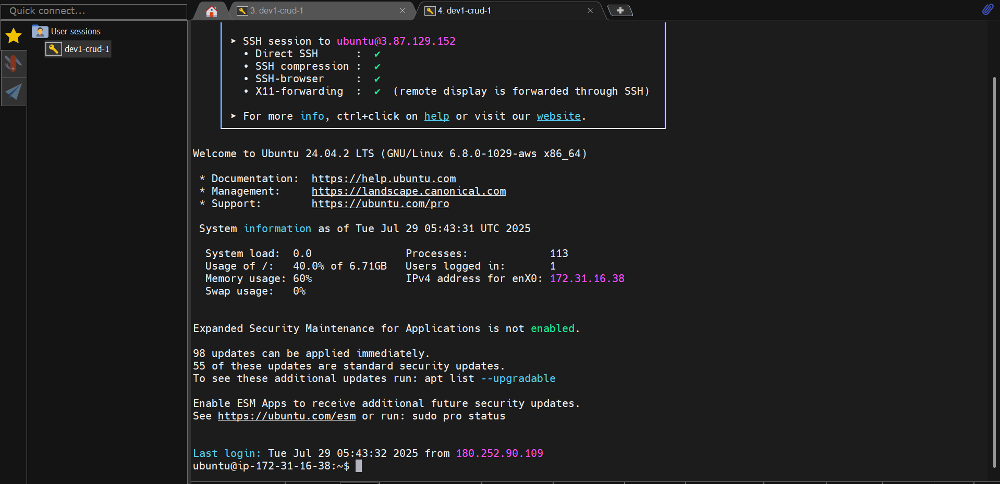

2. masuk ke folder api 

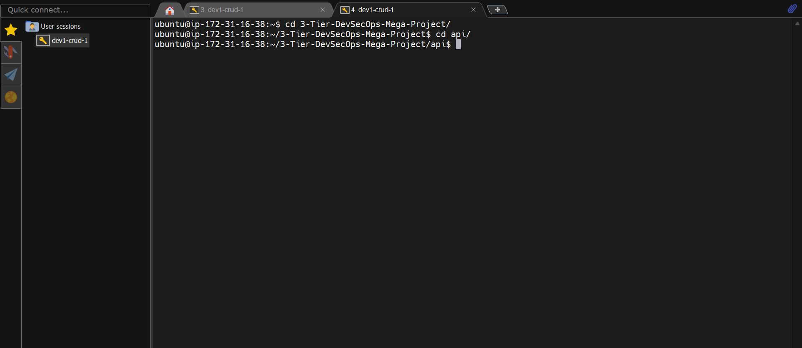

3. ubah .env sesuaikan dengan yang akan di pakai

```
DB_HOST=localhost
DB_USER=root
DB_PASSWORD=mtc0d3
DB_NAME=crud_app
JWT_SECRET=devopsShackSuperSecretKey
```

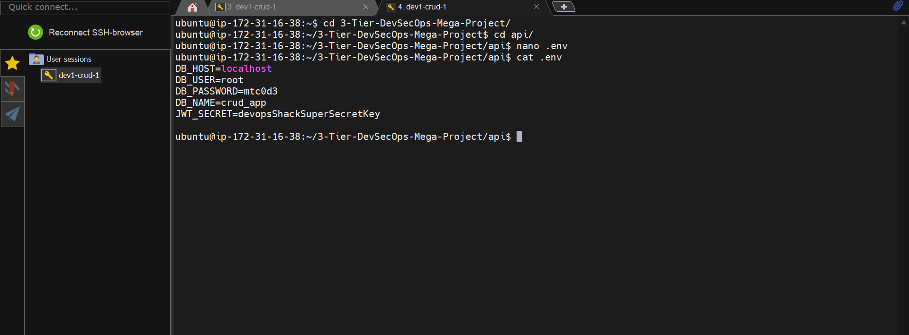


4. Install depedency nodejs di api

```
npm install
```

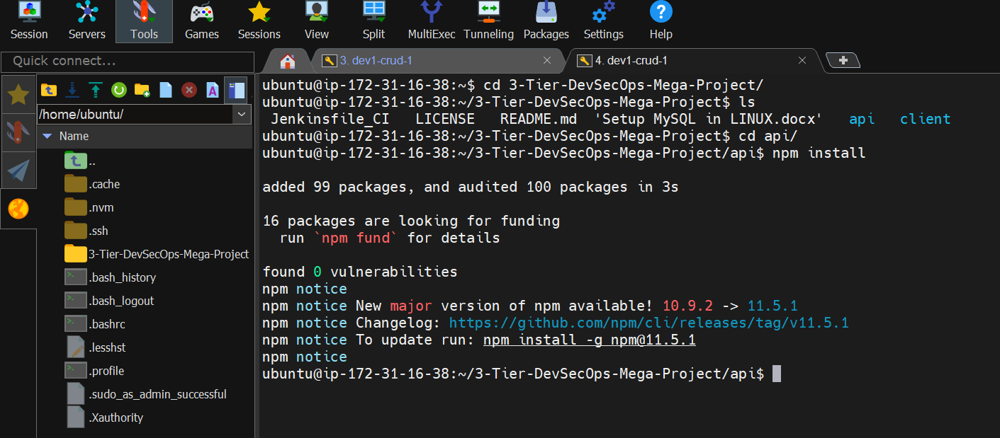

6. jalankan perintah berikut untuk insialisasi pm2

```
pm2 init
```

7. ubah file ecosystem.config.js

```
module.exports = {
  apps : [{
    name: 'crud-backend',
    script: 'npm start',
    watch: false,
  }],

  deploy : {
    production : {
      user : 'SSH_USERNAME',
      host : 'SSH_HOSTMACHINE',
      ref  : 'origin/master',
      repo : 'GIT_REPOSITORY',
      path : 'DESTINATION_PATH',
      'pre-deploy-local': '',
      'post-deploy' : 'npm install && pm2 reload ecosystem.config.js --env production',
      'pre-setup': ''
    }
  }
};
```

8. Jalankan be dengan perintah berikut

```
pm2 start
```

9. di be ini jika berjalan maka akan terbuat admin user

```
admin@example.com
admin123
```

## Jalankan Frontend

1. masuk ke folder client

2. lalu kita ubah juga .env sesuai apa yang akan dipakai di folder client menggunakan tab yang lainnya

```
REACT_APP_API=http://3.87.129.152:5000
```


3. di client telah di buat script testing yang ada di folder src 

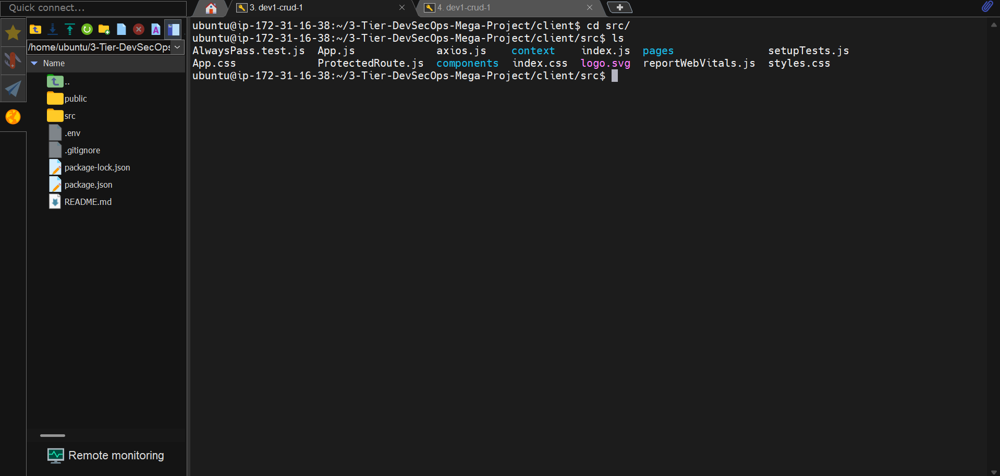

jalankan dengan perintah

```
npm run test
```

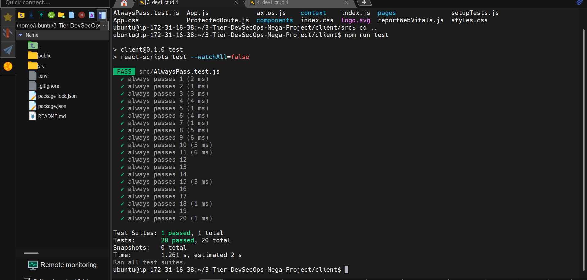

4. jalankan perintah berikut untuk insialisasi pm2

```
pm2 init
```

5. ubah file ecosystem.config.js

```
module.exports = {
  apps : [{
    name: 'crud-frontend',
    script: 'npm start',
    watch: false,
  }],

  deploy : {
    production : {
      user : 'SSH_USERNAME',
      host : 'SSH_HOSTMACHINE',
      ref  : 'origin/master',
      repo : 'GIT_REPOSITORY',
      path : 'DESTINATION_PATH',
      'pre-deploy-local': '',
      'post-deploy' : 'npm install && pm2 reload ecosystem.config.js --env production',
      'pre-setup': ''
    }
  }
};
```

6. Jalankan be dengan perintah berikut

```
pm2 start
```

## Akses app di browser

1. Copy public ip di browser lalu tambahkan dengan port yang sesuai

```
http://50.16.51.196:3000 // fe
http://50.16.51.196:5000 // be
```

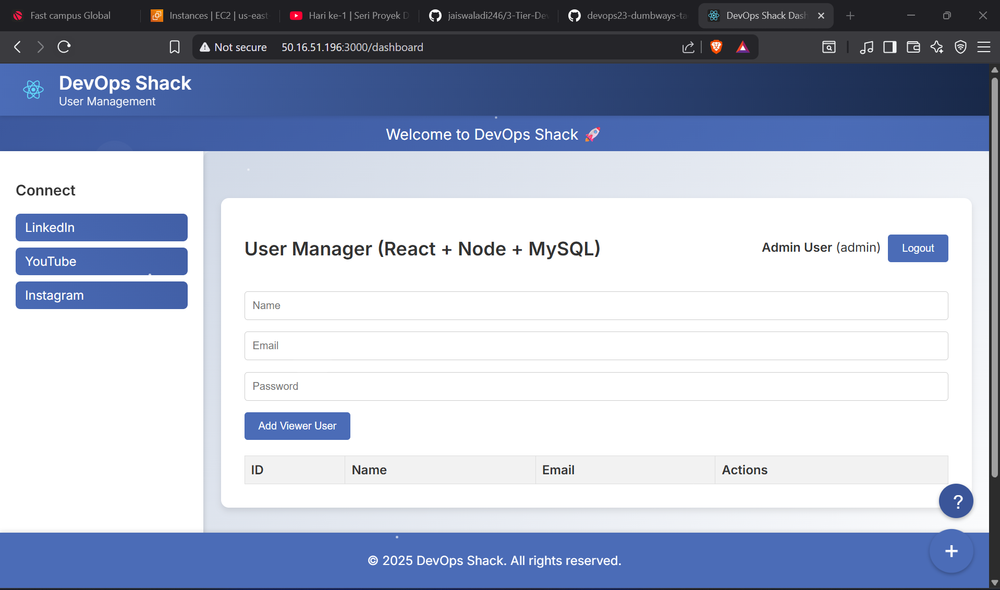