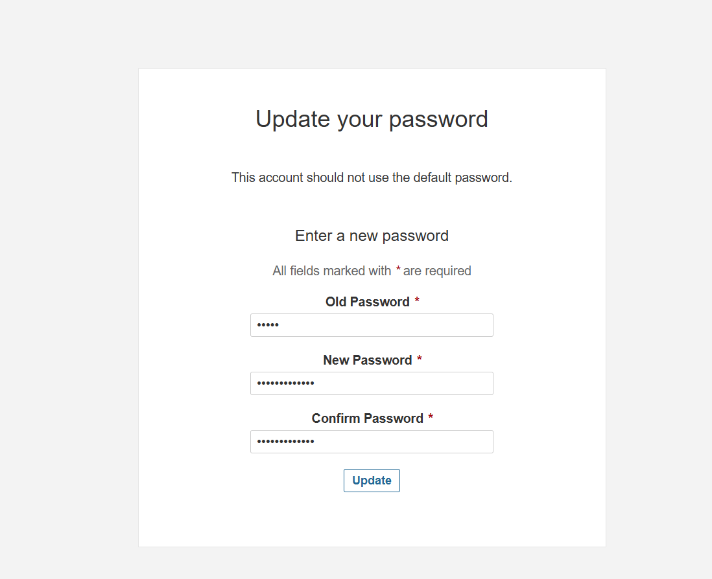

## Mebuat Infra dengan 2 Instance

1. Masuk ke account aws

2. Pilih ec2

3. Klik launch instance

4. Buat 2 instance


5. Untuk os pilih `ubuntu`

6. untuk instance type pilih `t2.medium`

7. Untuk key pair buat atau jika mau pakai yang sudah ada

8. untuk security group buatlah dengan membuka port seperti berikut


9. Untuk volume beri 15GB

10. Lalu klik launch instance

11. Beri nama instance seperti berikut


## Akses server dengan terminal (Mobaxterm)

1. Buat session baru dan buat keduanya


## Update server pertama kali

1. Lakukan update ke kedua server dengan perintah

```
sudo apt update
```

## Install Jenkins di server jenkins

1. Pertama kita harus install JDK di server karena jenkins ini berbasis java

```
sudo apt update
sudo apt install fontconfig openjdk-21-jre
java -version
```

2. kunjungin dokumentasi resmi jenkins

```
https://www.jenkins.io/doc/book/installing/linux/
```

3. install jenkin berbasis ubuntu versi lts

```
sudo wget -O /etc/apt/keyrings/jenkins-keyring.asc \
  https://pkg.jenkins.io/debian-stable/jenkins.io-2023.key
echo "deb [signed-by=/etc/apt/keyrings/jenkins-keyring.asc]" \
  https://pkg.jenkins.io/debian-stable binary/ | sudo tee \
  /etc/apt/sources.list.d/jenkins.list > /dev/null
sudo apt-get update
sudo apt-get install jenkins
```

4. akse browser dengan public ip dan port 8080

5. lihat Administrator password dengan perintah berikut

```
sudo cat /var/lib/jenkins/secrets/initialAdminPassword
```


6. untuk plugin pilih `install suggested plugins` aja terlebih dahulu


7. buat user admin


8. untuk `instance configuration` biarkan default aja dulu


9. klik `start using jenkins`


10. jenkins pun telah selesai terinstall


## Install SonarQube di server sonarqube

1. pertama kita install docker

2. kunjungi dokumentasi resmi docker

```
https://docs.docker.com/engine/install/ubuntu/
```

3. Lakukan perintah berikut

```
for pkg in docker.io docker-doc docker-compose docker-compose-v2 podman-docker containerd runc; do sudo apt-get remove $pkg; done
```

```
# Add Docker's official GPG key:
sudo apt-get update
sudo apt-get install ca-certificates curl
sudo install -m 0755 -d /etc/apt/keyrings
sudo curl -fsSL https://download.docker.com/linux/ubuntu/gpg -o /etc/apt/keyrings/docker.asc
sudo chmod a+r /etc/apt/keyrings/docker.asc

# Add the repository to Apt sources:
echo \
  "deb [arch=$(dpkg --print-architecture) signed-by=/etc/apt/keyrings/docker.asc] https://download.docker.com/linux/ubuntu \
  $(. /etc/os-release && echo "${UBUNTU_CODENAME:-$VERSION_CODENAME}") stable" | \
  sudo tee /etc/apt/sources.list.d/docker.list > /dev/null
sudo apt-get update
```

```
sudo apt-get install docker-ce docker-ce-cli containerd.io docker-buildx-plugin docker-compose-plugin
```

```
sudo usermod -aG docker $USER
```

```
newgrp docker
```

4. install sonarqube dengan container

```
docker run -d --name sonar -p 9000:9000 sonarqube:lts-community
```

```
docker ps
```

5. cek di browser dengan public ip dan port 9000


6. masuk dengan password default yaitu

```
admin

admin
```

7. lalu update password nya



8. maka installasi sonarqube telah selesai


## Install plugin yang diperlukan di jenkins

1. pergi ke manage jenkins


2. pilih plugins

3. pilih available plugins dan cari

```
Pipeline: Stage View

NodeJS

SonarQube Scanner
```

4. lalu klik install

5. checkbox untuk merestart jenkins setelah installasi

## Konfigurasi Tools untuk node js

1. Masuk ke manage jenkins

2. pilih tools

3. kita atur dulu untuk `nodejs`


## Buat CI/CD pipeline sampai gitleaks

1. klik `new item` untuk membuat job


2. pilih tipe nya `pipeline`

3. klik ok

4. untuk praktik terbaik kita pilih 3 riwayat saja yang di simpan dengan konfigurasi berikut


5. buat pipeline

- pertama kita buat pipeline `git checkout`

    ```
    pipeline {
        agent any

            stages {
                stage('Git Checkout') {
                    steps {
                    git branch: 'dev', url: 'https://github.com/MTC0D3/3-Tier-DevSecOps.git'
                    }
                }

            }

    }

    ```

- kedua kita buat pipeline `frontend compilation`, karena kita install nodejs maka di pipeline kita harus di definisikan tools nya

  ```
  pipeline {
    agent any

    tools {
        nodejs 'nodejs23'
    }

    stages {
        stage('Git Checkout') {
            steps {
              git branch: 'dev', url: 'https://github.com/MTC0D3/3-Tier-DevSecOps.git'
            }
        }

         stage('Frontend Compilation') {
            steps {
                dir('client') {
                    sh 'find . -name "*.js" -exec node --check {} +'
                }
            }
        }

    }
  }

  ```

- ketiga kita buat pipeline `backend compilation`, karena kita install nodejs maka di pipeline kita harus di definisikan tools nya

  ```
  pipeline {
    agent any

    tools {
        nodejs 'nodejs23'
    }

    stages {
        stage('Git Checkout') {
            steps {
              git branch: 'dev', url: 'https://github.com/MTC0D3/3-Tier-DevSecOps.git'
            }
        }

         stage('Frontend Compilation') {
            steps {
                dir('client') {
                    sh 'find . -name "*.js" -exec node --check {} +'
                }
            }
        }

        stage('Backend Compilation') {
            steps {
                dir('api') {
                    sh 'find . -name "*.js" -exec node --check {} +'
                }
            }
        }

    }
  }

  ```

- keempat kita buat pipeline `gitleaks`, untuk menemukan apakah data sensitif yang disimpan ke source code kita

  - install terlebih dahulu gitleaks di server jenkins

    ```
    sudo apt install gitleaks
    ```

  - baru kita masukan pipelinenya

    ```
         pipeline {
             agent any

             tools {
                 nodejs 'nodejs23'
             }

             stages {
                 stage('Git Checkout') {
                     steps {
                     git branch: 'dev', url: 'https://github.com/MTC0D3/3-Tier-DevSecOps.git'
                     }
                 }

                 stage('Frontend Compilation') {
                     steps {
                         dir('client') {
                             sh 'find . -name "*.js" -exec node --check {} +'
                         }
                     }
                 }

                 stage('Backend Compilation') {
                     steps {
                         dir('api') {
                             sh 'find . -name "*.js" -exec node --check {} +'
                         }
                     }
                 }

                 stage('Gitleaks Scan') {
                     steps {
                        sh 'gitleaks detect --source ./client --exit-code 1'
                        sh 'gitleaks detect --source ./api --exit-code 1'
                     }
                 }

             }
         }

    ```

## Buat konfigurasi tools dan pipeline untuk sonarqube 

1. untuk menjalankan sonarqube kita memerlukan server sonarqube dan scanner yang terinstall di jenkins

2. buka manage jenkins

3. klik tools

4. pilih sonarqube scanner


5. save

6. masuk ke server sonarqube 

7. pilih administration


8. pilih security klik users

9. buat token untuk authentikasi credentials


10. copy token 

11. di manage jenkin pilih credentials


12. klik di global dan buat credentials ikuti seperti berikut


13. lalu ke manage jenkins pilih system

14. cari SonarQube servers

15. klik add sonarqube, ikuti seperti berikut


16. klik save

17. buat pipeline nya

```
pipeline {
    agent any
    
    tools {
        nodejs 'nodejs23'
    }
    
    environment {
        SCANNER_HOME = tool 'sonar-scanner'
    }

    stages {
        stage('Git Checkout') {
            steps {
                git branch: 'dev', url: 'https://github.com/MTC0D3/3-Tier-DevSecOps.git'
            }
        }
        
         stage('Frontend Compilation') {
            steps {
                dir('client') {
                   sh 'find . -name "*.js" -exec node --check {} +'
                }
            }
        }
        
        stage('Backend Compilation') {
            steps {
                dir('api') {
                  sh 'find . -name "*.js" -exec node --check {} +'
                }
            }
        }
        
        stage('Gitleaks') {
            steps {
                sh 'gitleaks detect --source ./client --exit-code 1'
                sh 'gitleaks detect --source ./api --exit-code 1'
            }
        }
        
         stage('SonarQube Analysis') {
            steps {
              withSonarQubeEnv('sonar') {
                    sh '''$SCANNER_HOME/bin/sonar-scanner -Dsonar.projectName=NodeJS-Project \
                          -Dsonar.projectKey=NodeJS-Project'''
                }
            }
        }
        
    }
}
```

## Buat pipeline untuk quality gate

1. kita harus buat webhook di server sonarqube

2. klik administration

3. klik configuration pilih webhooks

4. create webhook dan ikuti seperti ini, maasukan url server jenkins


5. buat pipeline nya tahap ini harus berjalan maksimal hanya 1 jam jika lebih maka akan dibatalkan

```
pipeline {
    agent any
    
    tools {
        nodejs 'nodejs23'
    }
    
    environment {
        SCANNER_HOME = tool 'sonar-scanner'
    }

    stages {
        stage('Git Checkout') {
            steps {
                git branch: 'dev', url: 'https://github.com/MTC0D3/3-Tier-DevSecOps.git'
            }
        }
        
         stage('Frontend Compilation') {
            steps {
                dir('client') {
                   sh 'find . -name "*.js" -exec node --check {} +'
                }
            }
        }
        
        stage('Backend Compilation') {
            steps {
                dir('api') {
                  sh 'find . -name "*.js" -exec node --check {} +'
                }
            }
        }
        
        stage('Gitleaks') {
            steps {
                sh 'gitleaks detect --source ./client --exit-code 1'
                sh 'gitleaks detect --source ./api --exit-code 1'
            }
        }
        
         stage('SonarQube Analysis') {
            steps {
              withSonarQubeEnv('sonar') {
                    sh '''$SCANNER_HOME/bin/sonar-scanner -Dsonar.projectName=NodeJS-Project \
                          -Dsonar.projectKey=NodeJS-Project'''
                }
            }
        }
        
         stage('Quality Gate Check') {
            steps {
                timeout(time: 1, unit: 'HOURS') {
                    waitForQualityGate abortPipeline: false, credentialsId: 'sonar-token'
                }
            }
        }
        
    }
}
```

2. ubah menjadi abortPipeline: true, jiak quality gate melebihi 1 jam maka pipeline akan gagal

## Buat pipeline untuk Trivy FS scanner

1. diguanakan untuk cek dependency system file

2. kunjungi dokumnetasi resminya 

```
https://trivy.dev/latest/getting-started/installation/
```

3. install di server jenkins karena belum ada plugins nya

```
sudo apt-get install wget gnupg
wget -qO - https://aquasecurity.github.io/trivy-repo/deb/public.key | gpg --dearmor | sudo tee /usr/share/keyrings/trivy.gpg > /dev/null
echo "deb [signed-by=/usr/share/keyrings/trivy.gpg] https://aquasecurity.github.io/trivy-repo/deb generic main" | sudo tee -a /etc/apt/sources.list.d/trivy.list
sudo apt-get update
sudo apt-get install trivy
```

4. karena kita langsung install service nya di server jenkins maka kita tidak perlu mendefinisikan nya di pipeline, kita bisa langsung menggunakannya

```
pipeline {
    agent any
    
    tools {
        nodejs 'nodejs23'
    }
    
    environment {
        SCANNER_HOME = tool 'sonar-scanner'
    }

    stages {
        stage('Git Checkout') {
            steps {
                git branch: 'dev', url: 'https://github.com/MTC0D3/3-Tier-DevSecOps.git'
            }
        }
        
         stage('Frontend Compilation') {
            steps {
                dir('client') {
                   sh 'find . -name "*.js" -exec node --check {} +'
                }
            }
        }
        
        stage('Backend Compilation') {
            steps {
                dir('api') {
                  sh 'find . -name "*.js" -exec node --check {} +'
                }
            }
        }
        
        stage('Gitleaks') {
            steps {
                sh 'gitleaks detect --source ./client --exit-code 1'
                sh 'gitleaks detect --source ./api --exit-code 1'
            }
        }
        
         stage('SonarQube Analysis') {
            steps {
              withSonarQubeEnv('sonar') {
                    sh '''$SCANNER_HOME/bin/sonar-scanner -Dsonar.projectName=NodeJS-Project \
                          -Dsonar.projectKey=NodeJS-Project'''
                }
            }
        }
        
         stage('Quality Gate Check') {
            steps {
                timeout(time: 1, unit: 'HOURS') {
                    waitForQualityGate abortPipeline: false, credentialsId: 'sonar-token'
                }
            }
        }
        
        stage('Trivy FS Scan') {
            steps {
                sh 'trivy fs --format table -o fs-report.html .'
            }
        }
        
    }
}
```

5. ini akan cek apakah dia dapat menemukan package.json di kedua folder app nya yaitu client dan api

## Buat file Jenkinsfile

1. Setelah kita membuat semua kode pipeline kita simpan dalam file Jenkinsfile di repo nya


2. lalu konfigurasi nya kita ubah dan pilih dari scm


3. klik save 

4. jalankan build lagi untuk uji coba