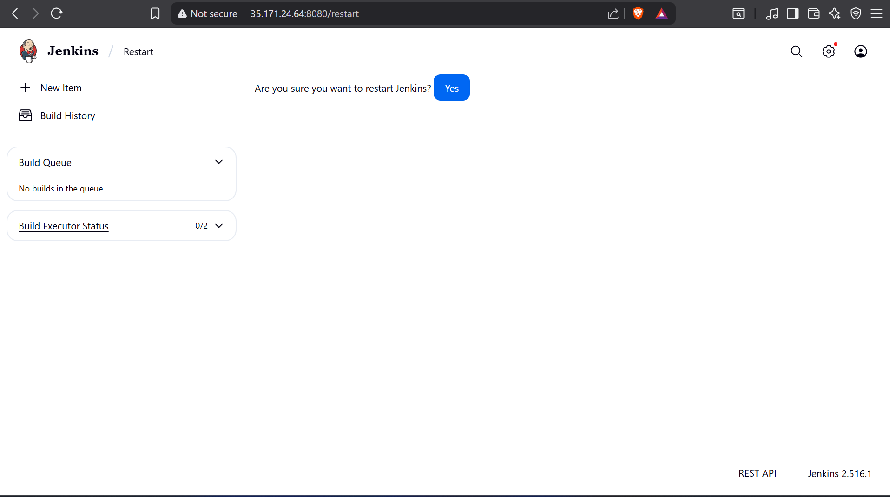
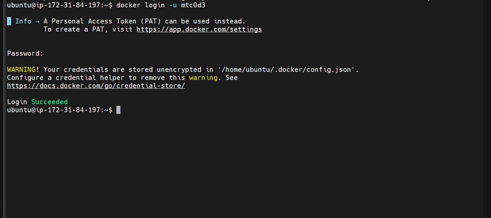
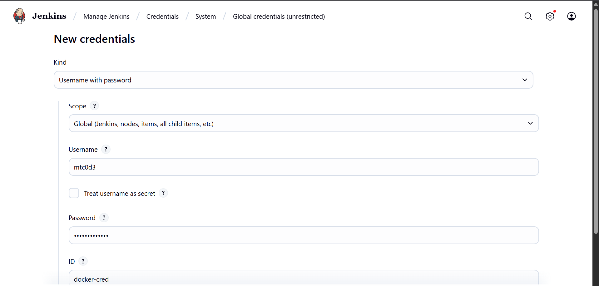
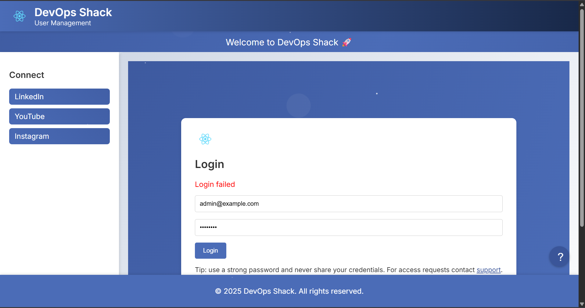

## CI/CD Docker

1. install docker di server jenkins

2. kunjungi situs resmi docker engine

```
https://docs.docker.com/engine/install/
```

3. pilih sesuai os yang digunakan, disini pakai ubuntu

4. Jalankan perintah berikut untuk menghapus semua paket yang bertentangan:

```
for pkg in docker.io docker-doc docker-compose docker-compose-v2 podman-docker containerd runc; do sudo apt-get remove $pkg; done
```

5. Siapkan Docker apt repositori

```
# Add Docker's official GPG key:
sudo apt-get update
sudo apt-get install ca-certificates curl
sudo install -m 0755 -d /etc/apt/keyrings
sudo curl -fsSL https://download.docker.com/linux/ubuntu/gpg -o /etc/apt/keyrings/docker.asc
sudo chmod a+r /etc/apt/keyrings/docker.asc

# Add the repository to Apt sources:
echo \
  "deb [arch=$(dpkg --print-architecture) signed-by=/etc/apt/keyrings/docker.asc] https://download.docker.com/linux/ubuntu \
  $(. /etc/os-release && echo "${UBUNTU_CODENAME:-$VERSION_CODENAME}") stable" | \
  sudo tee /etc/apt/sources.list.d/docker.list > /dev/null
sudo apt-get update
```

6. Instal paket Docker.

```
sudo apt-get install docker-ce docker-ce-cli containerd.io docker-buildx-plugin docker-compose-plugin
```

7. Tambahkan pengguna jenkin ke docker group.

```
sudo usermod -aG docker jenkins
```

8. Anda juga dapat menjalankan perintah berikut untuk mengaktifkan perubahan ke grup:

```
newgrp docker
```

9. test dengan salah satu perintah docker seperti

```
docker ps
```

10. install docker compose dengan mengunjungi dokumnetasi berikut

```
https://docs.docker.com/compose/install/standalone/
```

11. untuk linux gunakan script berikut

```
sudo curl -SL https://github.com/docker/compose/releases/download/v2.39.1/docker-compose-linux-x86_64 -o /usr/local/bin/docker-compose
```

12. apply dengan perintah berikut 

```
sudo chmod +x /usr/local/bin/docker-compose
```

13. Uji dan jalankan perintah Docker Compose menggunakan docker-compose

14. Jika perintah docker-compose gagal setelah instalasi, periksa jalur Anda. Anda juga dapat membuat tautan simbolis ke /usr/bin atau direktori lain di jalur Anda. Misalnya:

```
sudo ln -s /usr/local/bin/docker-compose /usr/bin/docker-compose
```

15. restart jenkins dengan ganti url seperti berikut, agar perubahan bisa diterapkan



## Menambahkan docker ke pipeline

1. install plugin

```
Docker Pipeline

Docker Compose Build Step
```

2. login ke docker hub dengan cli di server jenkins dengan perintah

```
docker login -u mtc0d3
```



3. buat credentials di jenkins dengan nama `docker-cred`



4. tambahkan script docker ke pipeline

```
pipeline {
    agent any
    
    tools {
        nodejs 'nodejs23'
    }
    
    environment {
        SCANNER_HOME = tool 'sonar-scanner'
    }

    stages {
        stage('Git Checkout') {
            steps {
                git branch: 'docker-build-deploy', url: 'https://github.com/MTC0D3/3-Tier-DevSecOps.git'
            }
        }
        
         stage('Frontend Compilation') {
            steps {
                dir('client') {
                   sh 'find . -name "*.js" -exec node --check {} +'
                }
            }
        }
        
        stage('Backend Compilation') {
            steps {
                dir('api') {
                  sh 'find . -name "*.js" -exec node --check {} +'
                }
            }
        }
        
        stage('Gitleaks') {
            steps {
                sh 'gitleaks detect --source ./client --exit-code 1'
                sh 'gitleaks detect --source ./api --exit-code 1'
            }
        }
        
         stage('SonarQube Analysis') {
            steps {
              withSonarQubeEnv('sonar') {
                    sh '''$SCANNER_HOME/bin/sonar-scanner -Dsonar.projectName=NodeJS-Project \
                          -Dsonar.projectKey=NodeJS-Project'''
                }
            }
        }
        
         stage('Quality Gate Check') {
            steps {
                timeout(time: 1, unit: 'HOURS') {
                    waitForQualityGate abortPipeline: false, credentialsId: 'sonar-token'
                }
            }
        }
        
        stage('Trivy FS Scan') {
            steps {
                sh 'trivy fs --format table -o fs-report.html .'
            }
        }

        stage('Build-Tag & Push Backend Docker Image') {
            steps {
                script {
                    withDockerRegistry(credentialsId: 'docker-cred') {
                        dir('api') {
                            sh 'docker build -t mtc0d3/backend:latest .'
                            sh 'trivy image --format table -o backend-image-report.html mtc0d3/backend:latest '
                            sh 'docker push mtc0d3/backend:latest'
                        }
                    }
                }
            }
        }  

        stage('Build-Tag & Push Frontend Docker Image') {
            steps {
                script {
                    withDockerRegistry(credentialsId: 'docker-cred') {
                        dir('client') {
                            sh 'docker build -t mtc0d3/frontend:latest .'
                            sh 'trivy image --format table -o frontend-image-report.html mtc0d3/frontend:latest '
                            sh 'docker push mtc0d3/frontend:latest'
                        }
                    }
                }
            } 
        }  

        stage('Docker Deploy via Compose') {
            steps {
                script {
                    sh 'docker compose up -d'
                }
            }
        }
        
    }
}
```

5. jangan lupa sesuaikan env frontend dan backend dengan url atau ip yang sesuai

6. silahkan build jika sudah benar

